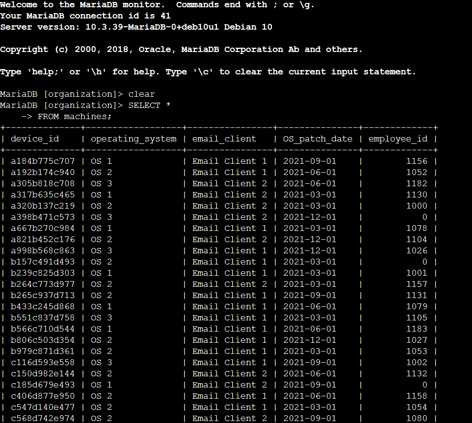
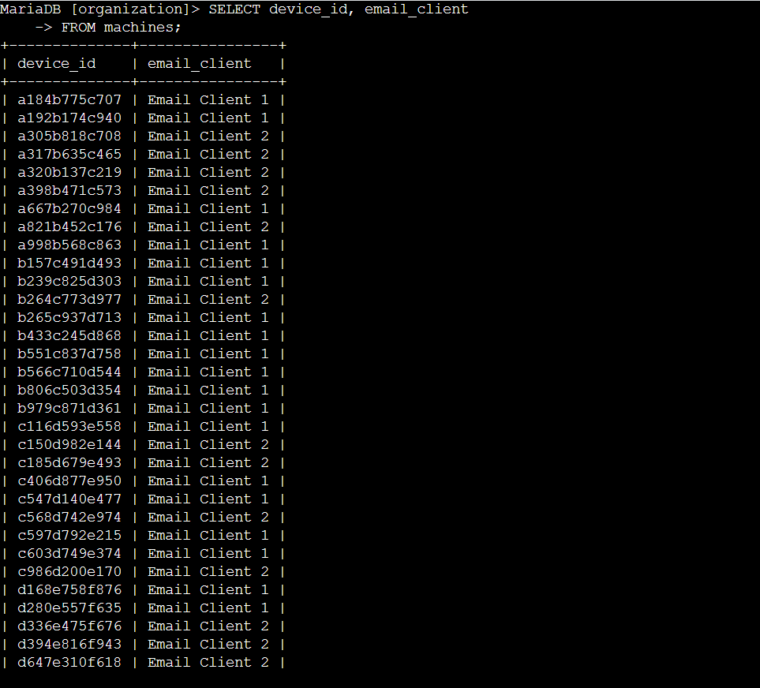
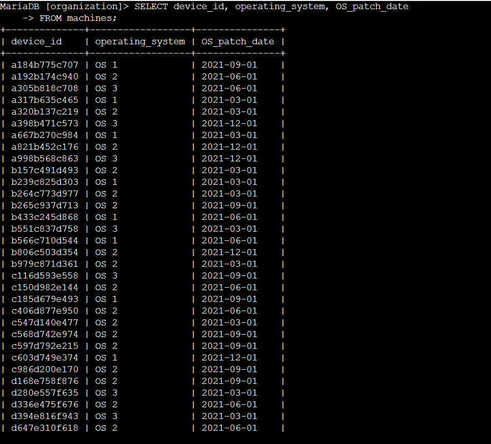
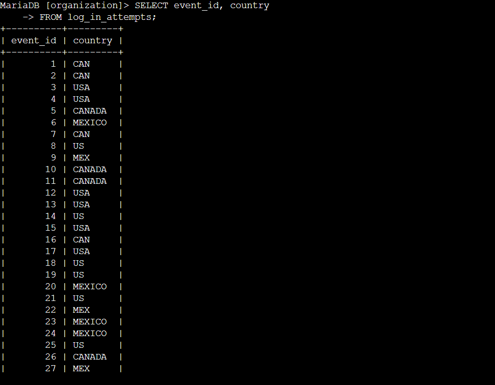
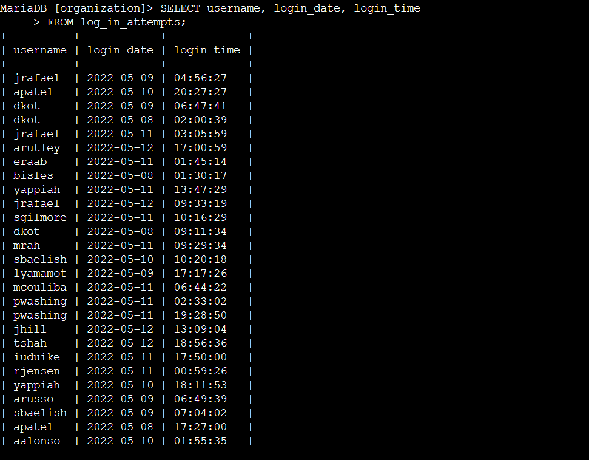
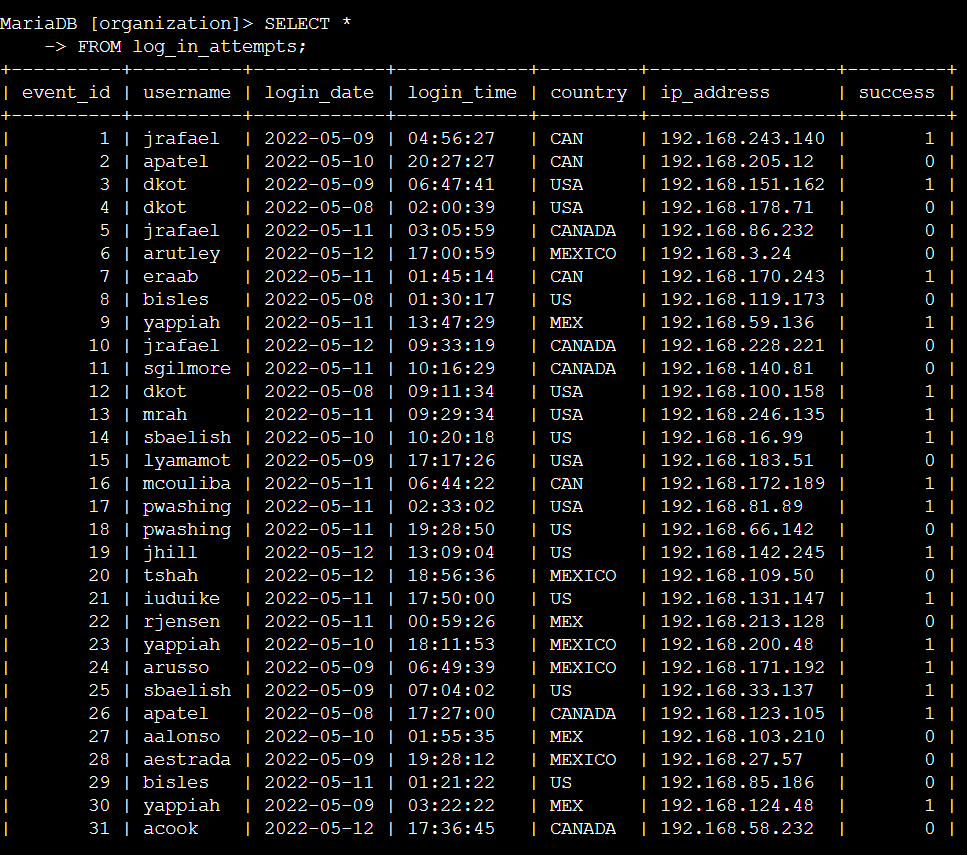
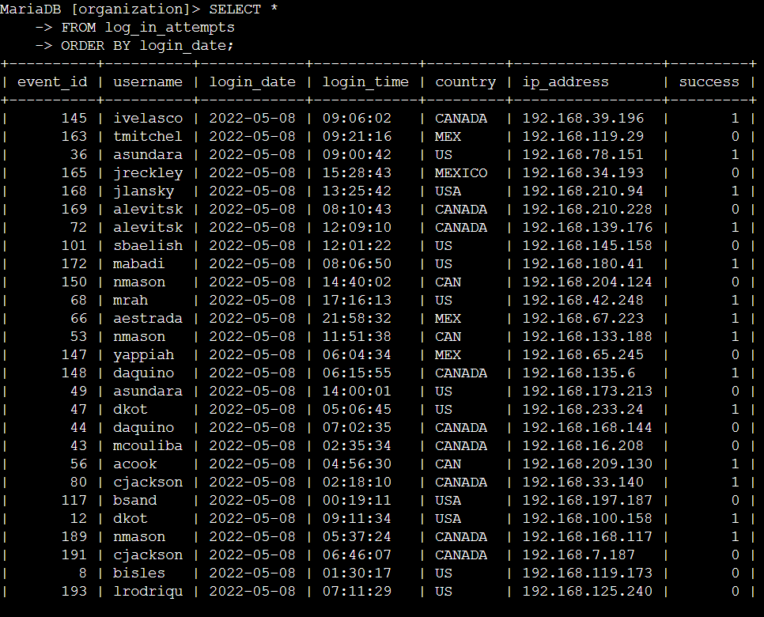
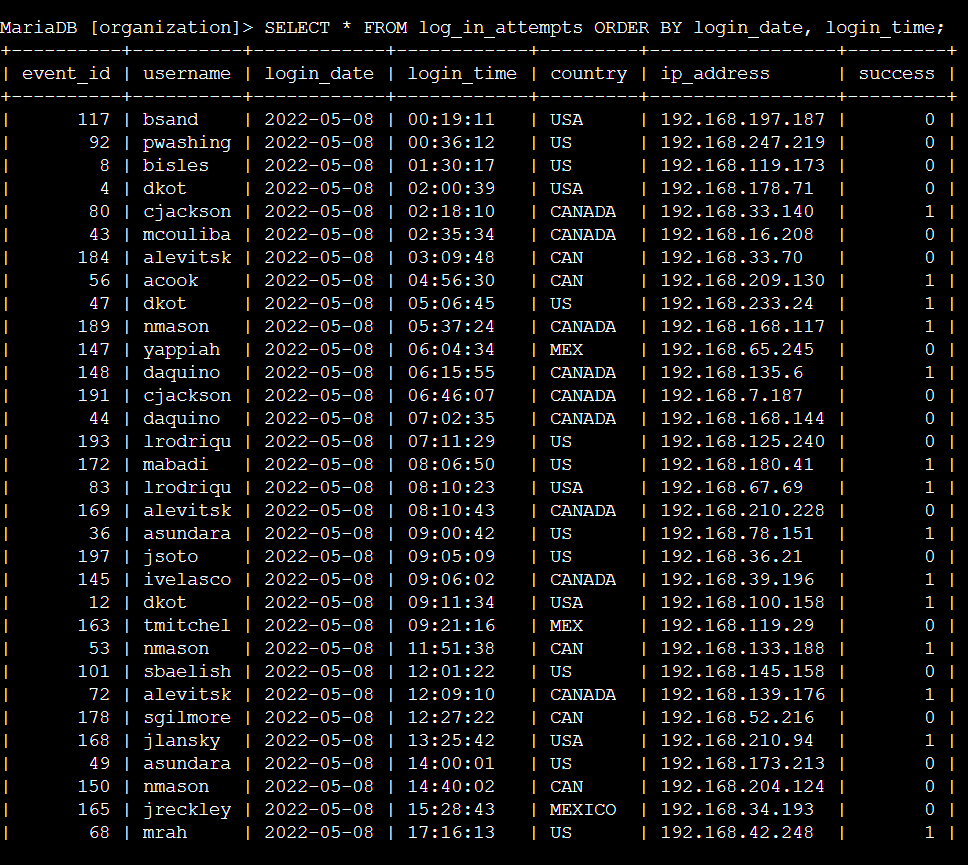

# Simple SQL Queries
In this project, I perform simple SQL queries by retrieving information from a database. I’ll be using the MariaDB shell to run my SQL queries.<br>
I have multiple tasks in this project:
  - Return information on employee devices
  - Examine login attempts
  - Sort the data returned from a query
#### Scenario
In this scenario, I have to determine which employee devices must be updated. I also need to investigate user login activity to explore if any unusual activity has occurred.

The information I need is located in the `machines` and `login_attempts` tables in the organization database.

## Retrieve employee device data
In this task, I need to obtain information on employee devices because my team needs to update them. The information I need is in the `machines` table in the `organization` database.

First, I need to retrieve all the information about the employee devices.

1. Running the following query will select all device information from the machines table:
```sql
SELECT *
FROM machines;
```
> Using the asterisk (`*`) returns all data from the specified table. Also, table names in MySQL are case-sensitive.

The output returns all the contents of the `machines` table:



2. I want to focus on the email client running on various devices. To do this, I need to query for `device_id` and `email_client` columns from the `machines` table.

```sql
SELECT device_id, email_client
FROM machines;
```


3. Now, I need information on the operating systems used on various devices and their last patch date.<br>
I need to query for `device_id`, `operating_system`, and `OS_patch_date` columns from the `machines` table.

```sql
SELECT device_id, operating_system, OS_patch_date
FROM machines;
```



## Investigate login activity
In this task, I to analyze the information from the `log_in_attempts` table to determine if any unusual activity has occurred.

1. First, I need to investigate the locations where login attempts were made to ensure that they’re in expected areas (the United States, Canada, or Mexico).

```sql
SELECT event_id, country
FROM log_in_attempts;
```


>There are no login attempts made from any other country?

2. Next, I need to check if login attempts were made outside of the organization's working hours.

```sql
SELECT username, login_date, login_time
FROM log_in_attempts;
```



3. Now, I need to get a complete picture of all login attempts.
```sql
SELECT *
FROM log_in_attempts;
```

## Order login attempts data

In this task, I need to use the `ORDER BY` keyword. I'll sequence the data that the query returns according to the login date and time.

1. First, I need to sort the information by date.

```sql
SELECT *
FROM log_in_attempts
ORDER BY login_date;
```


2. Now, I need to further organize the previous results by ordering them by `login_time`.
```sql
SELECT * 
FROM log_in_attempts
ORDER BY login_date, login_time;
```


## Summary
I made this project to demonstrate I have practical experience in running basic SQL queries to: 

- select specific columns from a table,
- select all columns from a table by using an asterisk (*), and
- sort query results using the ORDER BY keyword.

These basic queries form the foundation for running more advanced queries and applying more complex filters later.
